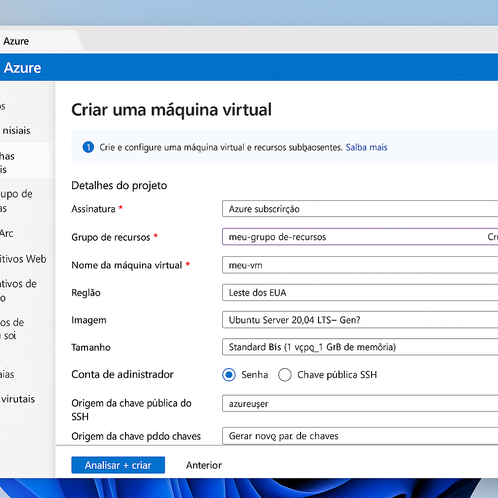

# Laboratório: Criando Máquinas Virtuais na Azure 

Este repositório foi criado para documentar o processo de criação e configuração de uma máquina virtual (VM) utilizando a plataforma Microsoft Azure, como parte do desafio proposto pela DIO.

---

## Objetivo

- Praticar o uso da Azure na criação de uma VM
- Documentar o processo técnico de forma clara e estruturada
- Utilizar o GitHub como ferramenta de compartilhamento e versionamento

---

## Passo a Passo Realizado

### 1. Acesso ao Portal da Azure
- Acesse o link: [https://portal.azure.com](https://portal.azure.com)
- Faça login com sua conta Microsoft.

### 2. Criação da Máquina Virtual
- Vá em **"Máquinas Virtuais" > "Criar" > "Máquina Virtual"**
- Configurações utilizadas:
  - Nome: `vm-lab-dio`
  - SO: Windows 10 ou Ubuntu 
  - Tamanho: B1s
  - Região: Brasil Sul
  - Autenticação: Chave SSH ou senha

### 3. Acesso à Máquina Virtual
- Após a criação, clique em "Conectar"
- Se for Windows, use RDP
- Se for Linux, use SSH

---

## Tecnologias Utilizadas

- Microsoft Azure
- Git e GitHub
- Markdown

---

##  Dicas e Observações

- Sempre verifique os grupos de recursos para manter o ambiente organizado
- Lembre-se de excluir a VM após o teste para evitar cobrança

---

## Capturas de Tela

As imagens do processo estão disponíveis na pasta `/images`.

